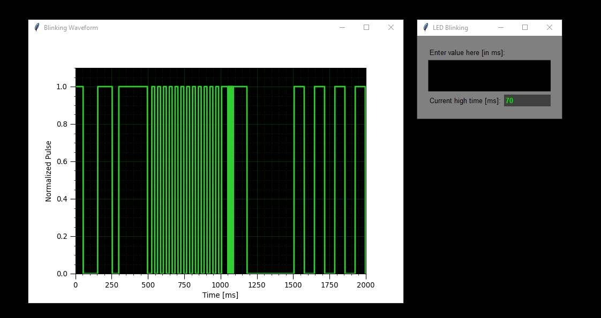
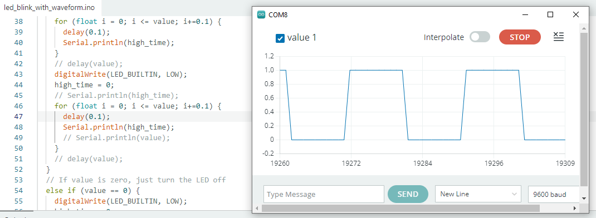

# LED Blinking
_Last Update: November 12, 2025_

Figure 1. Screenshot of the Python (Tkinter) UI which enters the duration (0-1000 ms) the LED turns ON and OFF (right widget). The plot on the left shows the waveform of the controlled LED blinking, but it does not correspond to the real-time blinking.

Figure 2. Screenshot of the equivalent and similar waveform in Arduino with the serial plotter.

## Background
After my previous mock keypad project, I have become more excited to do a lot of similar projects involving circuitry and algorithm development in Python and Arduino/C++. I realized that Arduino UNO had a built-in LED, and I would like to extend the keypad project to control the LED blinking time. However, I did not want to complicate things much since I was trying new things. But I'd like to keep it more exciting, so I decided to build an LED blinking system where the blinking rate would be controlled by sending signals from a Python UI.

##
